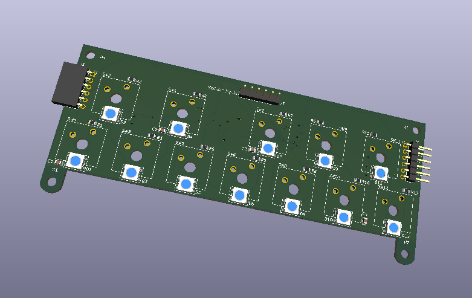

# FPGA-Musical-Synth
A musical synthesizer based on the iCE40 FPGA that outputs I2S audio.

Video demonstration of sine wave synth: https://youtu.be/_ejQGvuSiI8

### 29 April 2026: Key Input PCB design complete!
The PCB for the input module has been completed. Each module represents 1 octave (12 keys). We decided to use shift registers to read key input in parallel and send out that data to the FPGA as serial (PISO). This provides a few advantages over other methods of key input:
1. We use a fixed # of pins on the FPGA regardless of the # of keys or modules.
2. Because we are using shift registers, each module can be designed to connect to one another, increasing the number of available octaves.
3. PCB order quantity minimums do not produce useless boards because each board represents one octave and you can connect multiple boards together. Thus, if I only wanted to order the minimum, which is often five, I would still be able to use all of the boards and get five ocatves (assuming there are not faults with the board).

> The order for this PCB will be placed within a week or two; I am waiting to order it alongside PCBs for a class I'm currently taking. This PCB does not have a place for the pico2-ice development board to plug in to. Making a dedicated PCB for the FPGA is a low priority at the moment.

#### Current limitations:
1. FPGA still only supports one key press at a time.
 

### 12 March 2026: Numerically Controlled Oscillator (NCO)
Video demonstration of sine wave synth: https://youtu.be/_ejQGvuSiI8

The synth now makes sine waves by the Numerically-Controlled Oscillator (NCO)! This opens the door to make any kind of wave we want just by updating the ROMs. Additionally, a multi-clock cycle multiplication algorithm has been implemented to save space on the FPGA and take advantage of the 512 master clock cycles between one sample and the next.

#### Current limitations:
1. Only supports one key press at a time.
 

### 2 Feb 2026: Square Wave Synthesizer
Video demonstration of square wave synth: https://youtu.be/o0nXdgJRZlI

The wave_period_selector method of synthesis used is described by this process:
> wave_period_selector sends the half-period of the frequency (musical note) associated with the key pressed to i2s_transmitter. i2s_transmitter sends a square wave via I2S that oscillates every half-period (the one sent to it by wave_period_selector) to an I2S DAC. This generates a square wave at the desired frequency.

The square wave synth only supports one key press at a time. If multiple keys are pressed, the key that gets checked first in wave_period_selector is the note that gets played. Further, due to the nature of this synthesis, this only supports square waves.
 

### Hardware:
1. pico2-ice development board
2. Adafruit I2S 3W Class D Amplifier

### Software Tools:
##### 1. RTL Synthesis:
> OSS-CAD-SUITE is being used for iCE40 synthesis, Place-and-Route, as well as packing.
##### 2. Simulation:
> Icarus Verilog (iverilog) is being used for test bench simulation and other debugging. Verilator may replace icarus if it is decided that it is superior for testbenching this project's verilog modules.
##### 3. HDL:
> The FPGA was programmed in SystemVerilog.
